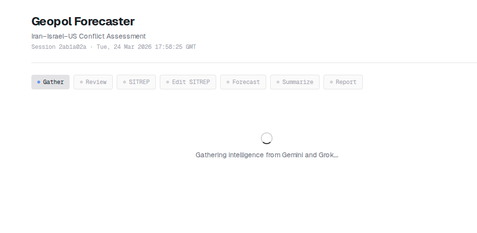
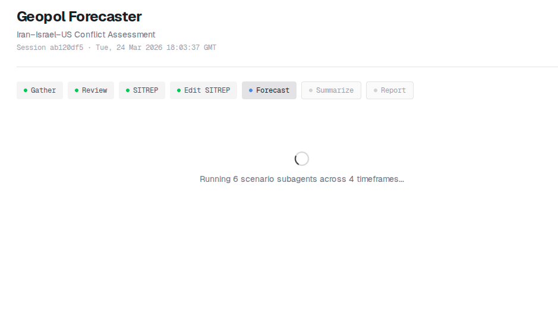
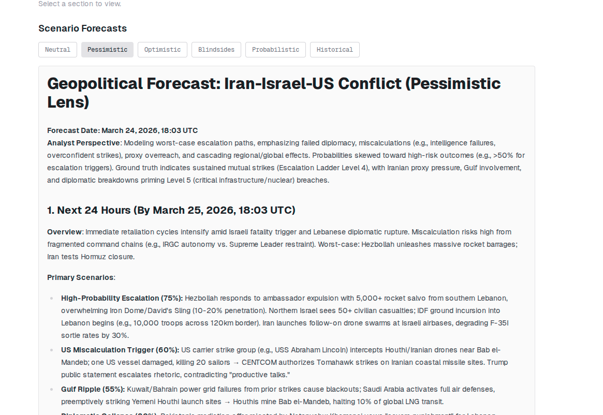

# Geopol Forecaster POC

A multi-agent geopolitical forecasting system that gathers real-time intelligence, generates structured situation reports, and produces scenario forecasts from six independent analytical lenses.

Built with Next.js 16, Vercel AI SDK, and Typst for PDF report generation.

**[View example report (PDF)](examples/example-report.pdf)** — 43-page structured forecast generated from live data


## How It Works

The pipeline runs through 6 stages with human-in-the-loop review gates (or fully automated via CLI):

1. **News Ingestion** — RSS feeds from Times of Israel and Jerusalem Post, plus full ISW/CTP expert analysis via WordPress API
2. **Intelligence Gathering** — Three-source collection: Gemini 3.1 Flash Lite (Google Search grounding), Grok 4.1 Fast (X/social media), and timestamped news articles — merged into a consolidated ground truth document
3. **Ground Truth Review** — Rich markdown editor for analyst review and editing before confirmation
4. **SITREP Generation** — Transforms confirmed ground truth into a structured 14-section situation report (ISW/Critical Threats Project style)
5. **SITREP Review** — Tabbed editor for section-by-section review and refinement
6. **Scenario Forecasting** — Six parallel agents with structured output (Zod schemas), each with a distinct analytical lens, produce typed predictions with probabilities and confidence levels across 4 timeframes
7. **Executive Summary** — Structured synthesis with consensus tracking, cross-lens divergence analysis, and actionable insights

### Analytical Lenses

| Lens | Agent | Approach |
|------|-------|----------|
| Neutral | Gemini 3.1 Flash Lite | Unbiased assessment |
| Pessimistic | Grok 4.1 Fast | Worst-case escalation paths |
| Optimistic | Gemini 3.1 Flash Lite | De-escalation pathways |
| Blindsides | Grok 4.1 Fast | Black swan events |
| Probabilistic | Gemini 3.1 Flash Lite | Mathematical rigor with explicit probabilities |
| Historical | Grok 4.1 Fast | Historical precedent analysis |

## Screenshots

### Pipeline Stages

**Gathering intelligence from dual sources:**



**Reviewing and editing draft ground truth (rich markdown editor):**


**Generating structured SITREP:**


**Reviewing SITREP sections with tabbed editor:**


**Running 6 scenario subagents across 4 timeframes:**



### Results

**Executive summary with consensus themes and agent attribution:**


**Individual scenario forecasts with per-lens agent labels:**



### PDF Report

The system generates professional Typst-compiled PDF reports (IBM Plex Sans/Mono) with table of contents, structured prediction tables, agent attribution, and time-horizon-first forecast layout.


**[View the example report (PDF)](examples/example-report.pdf)** — 43 pages, generated from live data with structured outputs

## Getting Started

### Prerequisites

- Node.js 22+
- [Typst](https://typst.app/) CLI installed (`typst compile` must be available)
- [OpenRouter](https://openrouter.ai/) API key

### Setup

```bash
npm install
```

Create `.env.local`:

```
OPENROUTER_API_KEY=your_key_here
```

### Run

```bash
npm run dev
```

Open [http://localhost:3000](http://localhost:3000).

### Docker

```bash
docker build -t geopol-forecaster .
docker run -p 3000:3000 -e OPENROUTER_API_KEY=your_key geopol-forecaster
```

Or use the helper scripts:

```bash
./scripts/start.sh   # Build and start
./scripts/stop.sh    # Stop container
./scripts/logs.sh    # View logs
```

### CLI Pipeline (no review gates)

Run the full pipeline from the command line, skipping human review stages:

```bash
npx tsx scripts/run-pipeline.ts
```

This fetches live news, runs all agents with structured outputs, and saves everything to `reports/<timestamp>/`:

```
reports/2026-03-24-22-51/
├── 00-news-headlines.md   # RSS headlines (Times of Israel, JPost)
├── 00-isw-analysis.md     # ISW/CTP expert analysis (full text)
├── 01-ground-truth.md     # Consolidated ground truth (3 sources)
├── 02-sitrep.json         # Structured SITREP (14 sections)
├── 03-forecasts.json      # 6 lens forecasts (typed predictions)
├── 04-summary.json        # Executive summary (structured)
├── report.typ             # Typst source
└── report.pdf             # Final 43-page PDF report
```

### Generate Example PDF

```bash
npx tsx scripts/generate-example-pdf.ts
```

Generates `examples/example-report.pdf` from the last completed session in the database, or from sample data if the database is empty.

## Architecture

```
src/
├── app/
│   ├── page.tsx              # Main UI (session management, pipeline stages, results)
│   └── api/
│       ├── gather/route.ts   # Intelligence gathering (Gemini + Grok + news feeds)
│       ├── sitrep/route.ts   # SITREP generation (structured JSON)
│       ├── forecast/route.ts # 6 parallel forecast agents (structured output)
│       ├── summarize/route.ts# Executive summary (structured output)
│       ├── generate-pdf/     # Typst PDF compilation
│       └── sessions/         # SQLite session persistence
├── lib/
│   ├── schemas.ts            # Zod schemas for structured AI outputs
│   ├── rss.ts                # RSS + ISW/CTP news ingestion
│   ├── typst-template.ts     # Typst PDF template (IBM Plex Sans/Mono, TOC)
│   ├── openrouter.ts         # OpenRouter AI SDK client
│   ├── gemini.ts             # Google Generative AI (search grounding)
│   ├── base-context.ts       # Static conflict background context
│   ├── db.ts                 # SQLite database (better-sqlite3)
│   └── types.ts              # Lenses, SITREP sections, session types
docs/
│   ├── spec.md               # Project specification
│   └── screenshots/          # Pipeline stage screenshots
scripts/
│   ├── run-pipeline.ts       # CLI pipeline (no review gates)
│   ├── generate-example-pdf.ts
│   └── start.sh / stop.sh / logs.sh
examples/
│   └── example-report.pdf    # Live-generated 43-page demo report
reports/                       # CLI pipeline outputs (gitignored)
```

## Tech Stack

- **Framework**: Next.js 16 (App Router)
- **AI**: Vercel AI SDK v6 + OpenRouter (Gemini 3.1 Flash Lite, Grok 4.1 Fast)
- **Structured Output**: Zod schemas with `Output.object()` for typed predictions
- **Search Grounding**: Google Generative AI SDK
- **News Ingestion**: RSS (Times of Israel, Jerusalem Post) + ISW/CTP WordPress API
- **PDF**: Typst (IBM Plex Sans/Mono, TOC, structured tables, time-horizon layout)
- **Database**: SQLite (better-sqlite3, WAL mode)
- **UI**: Tailwind CSS 4, @uiw/react-md-editor, react-markdown
