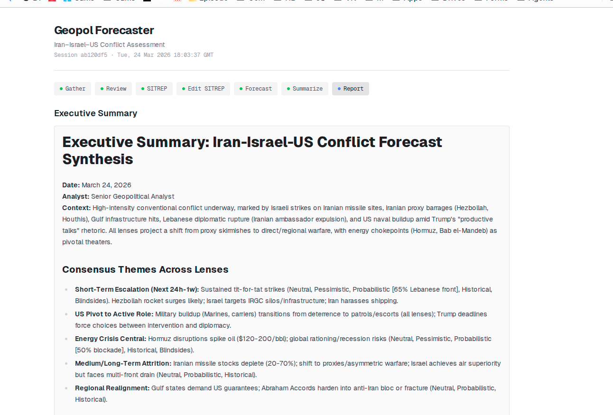
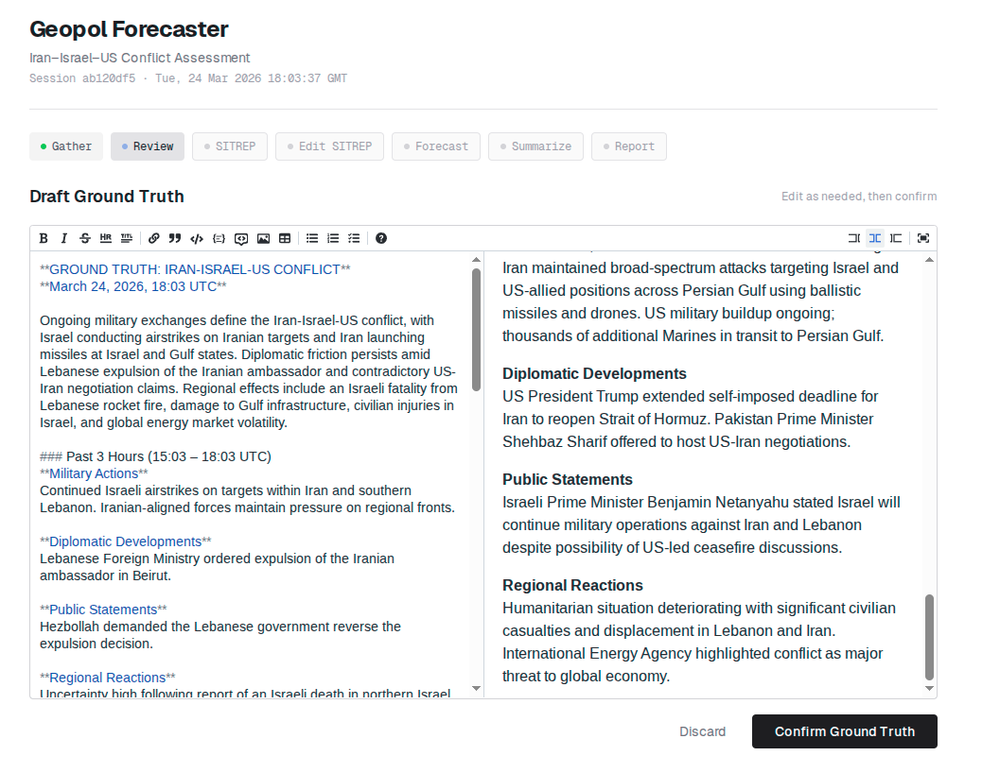
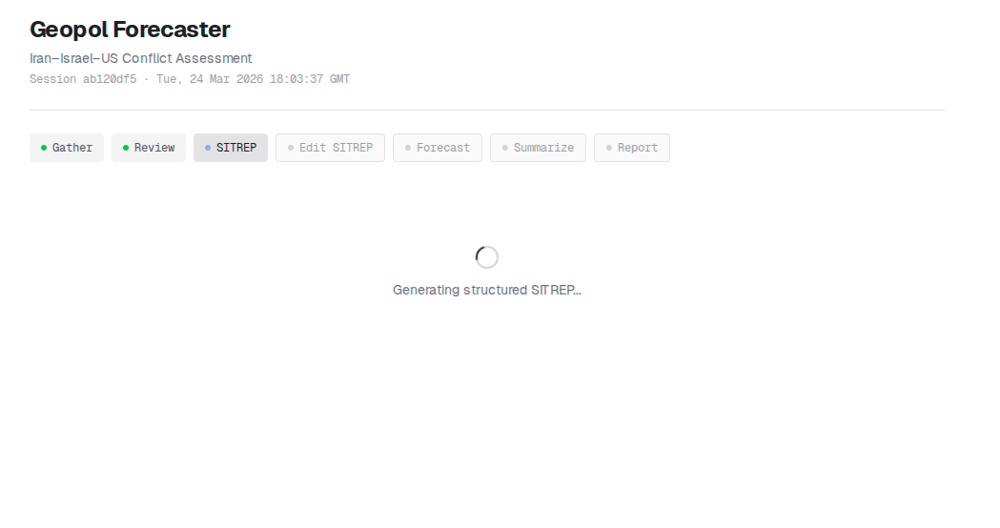
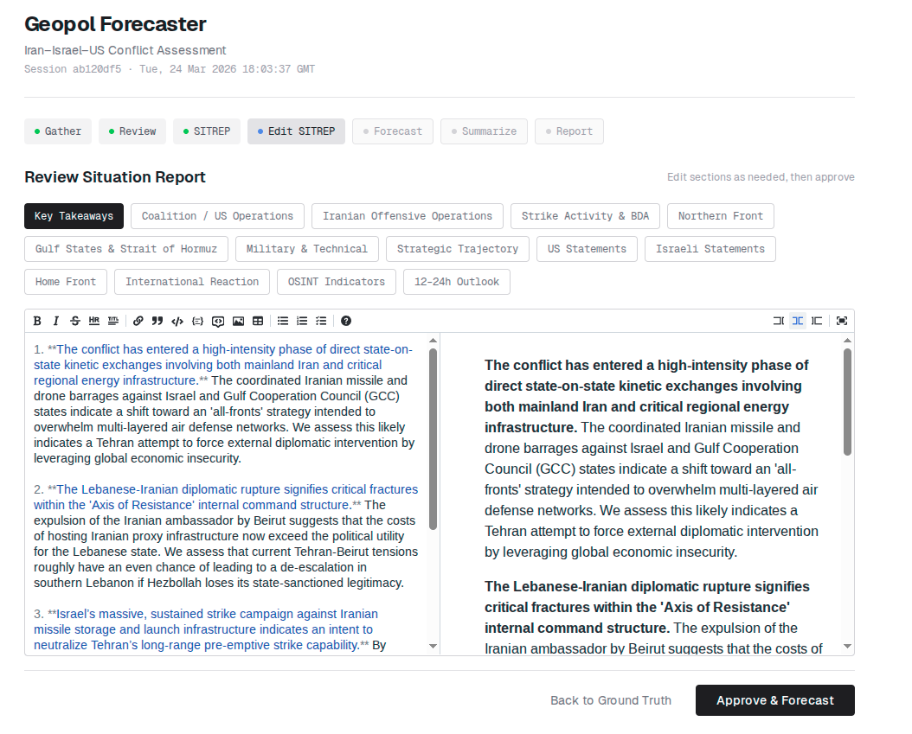
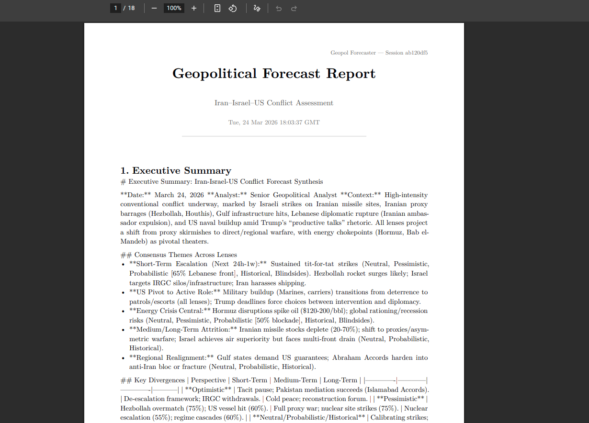

# Geopol Forecaster POC

A multi-agent geopolitical forecasting system that gathers real-time intelligence, generates structured situation reports, and produces scenario forecasts from six independent analytical lenses.

Built with Next.js 16, Vercel AI SDK, and Typst for PDF report generation.



## How It Works

The pipeline runs through 5 stages with human-in-the-loop review gates:

1. **Intelligence Gathering** — Dual-source collection from Gemini 3.1 Flash Lite (with Google Search grounding) and Grok 4.1 Fast, merged into a unified ground truth document
2. **Ground Truth Review** — Rich markdown editor for analyst review and editing before confirmation
3. **SITREP Generation** — Transforms confirmed ground truth into a structured 14-section situation report (ISW/Critical Threats Project style)
4. **SITREP Review** — Tabbed editor for section-by-section review and refinement
5. **Scenario Forecasting** — Six parallel agents, each with a distinct analytical lens, produce forecasts across 4 timeframes (24h, 1 week, 1 month, 1 year)
6. **Executive Summary** — Synthesis of all six forecasts into a single actionable assessment

### Analytical Lenses

| Lens | Agent | Approach |
|------|-------|----------|
| Neutral | Gemini 3.1 Flash Lite | Unbiased assessment |
| Pessimistic | Grok 4.1 Fast | Worst-case escalation paths |
| Optimistic | Gemini 3.1 Flash Lite | De-escalation pathways |
| Blindsides | Grok 4.1 Fast | Black swan events |
| Probabilistic | Gemini 3.1 Flash Lite | Mathematical rigor with explicit probabilities |
| Historical | Grok 4.1 Fast | Historical precedent analysis |

## Screenshots

### Pipeline Stages

**Gathering intelligence from dual sources:**


**Reviewing and editing draft ground truth (rich markdown editor):**



**Generating structured SITREP:**



**Reviewing SITREP sections with tabbed editor:**



**Running 6 scenario subagents across 4 timeframes:**


### Results

**Executive summary with consensus themes and agent attribution:**


**Individual scenario forecasts with per-lens agent labels:**


### PDF Report

The system generates professional Typst-compiled PDF reports with full markdown rendering, tables, agent attribution, and a run analysis page.



[Download the example PDF report](examples/example-report.pdf)

## Getting Started

### Prerequisites

- Node.js 22+
- [Typst](https://typst.app/) CLI installed (`typst compile` must be available)
- [OpenRouter](https://openrouter.ai/) API key

### Setup

```bash
npm install
```

Create `.env.local`:

```
OPENROUTER_API_KEY=your_key_here
```

### Run

```bash
npm run dev
```

Open [http://localhost:3000](http://localhost:3000).

### Docker

```bash
docker build -t geopol-forecaster .
docker run -p 3000:3000 -e OPENROUTER_API_KEY=your_key geopol-forecaster
```

Or use the helper scripts:

```bash
./scripts/start.sh   # Build and start
./scripts/stop.sh    # Stop container
./scripts/logs.sh    # View logs
```

### Generate Example PDF

```bash
npx tsx scripts/generate-example-pdf.ts
```

Generates `examples/example-report.pdf` from the last completed session in the database, or from sample data if the database is empty.

## Architecture

```
src/
├── app/
│   ├── page.tsx              # Main UI (session management, pipeline stages, results exploration)
│   └── api/
│       ├── gather/route.ts   # Stage 1: Dual-source intelligence gathering
│       ├── sitrep/route.ts   # Stage 3: SITREP generation
│       ├── forecast/route.ts # Stage 5: 6 parallel forecast agents
│       ├── summarize/route.ts# Stage 6: Executive summary synthesis
│       ├── generate-pdf/     # Typst PDF compilation
│       └── sessions/         # SQLite session persistence
├── lib/
│   ├── typst-template.ts     # Markdown→Typst conversion + PDF template
│   ├── openrouter.ts         # OpenRouter AI SDK client
│   ├── gemini.ts             # Google Generative AI client (search grounding)
│   ├── base-context.ts       # Static conflict background context
│   ├── db.ts                 # SQLite database (better-sqlite3)
│   └── types.ts              # Lenses, SITREP sections, session types
data/
│   └── geopol.db             # SQLite database (auto-created)
scripts/
│   ├── generate-example-pdf.ts
│   ├── start.sh / stop.sh / logs.sh
examples/
│   └── example-report.pdf    # Sample generated report
```

## Tech Stack

- **Framework**: Next.js 16 (App Router)
- **AI**: Vercel AI SDK + OpenRouter (Gemini 3.1 Flash Lite, Grok 4.1 Fast)
- **Search Grounding**: Google Generative AI SDK
- **PDF**: Typst (markdown→Typst conversion with tables, formatting, agent attribution)
- **Database**: SQLite (better-sqlite3, WAL mode)
- **UI**: Tailwind CSS 4, @uiw/react-md-editor, react-markdown
